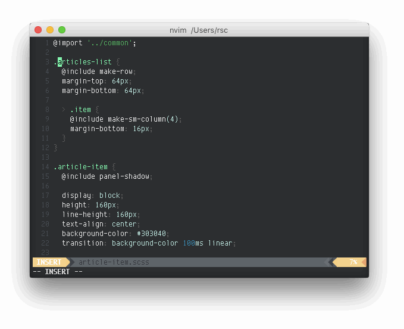

# vim-xtract

> Extract the selection into a new file

vim-xtract helps you split up large files into smaller files. Great for refactoring.



## Installation

Add `rstacruz/vim-xtract` using your favorite Vim plugin manager. For [vim-plug](https://github.com/junegunn/vim-plug), that's:

```vim
Plug 'rstacruz/vim-xtract'
```

## Usage

Select lines using visual selection (<kbd>V</kbd>) or using text objects (<kbd>v</kbd><kbd>ap</kbd><kbd>ap</kbd>...). Then type:

```
:Xtract newfilename⏎
```

This extracts the selected lines from the current file into a new file (e.g. `newfilename.js`) in the same directory. If the new file doesn't have an extension, it will automatically be the same as the original.

## Copying headers

You can copy the file's headers and automatically add an import statement to the original file (eg, `import X from './X'`):

```
:'<,'>Xtract FILENAME HEADERSIZE
```

- `'<,'>` — the range of the body
- `FILENAME` — the new file (extension may be omitted)
- `HEADERSIZE` — number of lines in the header (optional)

#### Example

Let's say you have a file like this `index.js` below. We want to extract the header (first 3 lines) and a function body (last 3 lines) into a new file, `MyComponent.js`.

```
[index.js]
 1   // @flow
 2   import React from 'react'
 3
 4   export function App () {
 5     return <MyComponent />
 6   }
 7
 8   export function MyComponent () {
 9     return <div></div>
10   }
```

Select lines (e.g. lines `8` to `10`) using visual mode (<kbd>V</kbd>), then type:

```
:Xtract MyComponent 3⏎
```

This copies the header (lines 1-3) and pastes the selected block right after it into a new file buffer. The import statement referencing the new file will be inserted right before the last line of the header in the original file. The resulting files will look like these:

```diff
 [index.js]
  // @flow
  import React from 'react'
+ import MyComponent from './MyComponent'

  export function App () {
    return <MyComponent />
  }

- export function MyComponent () {
-   return <div></div>
- }
+ /* ./MyComponent.js */
```

```diff
 [MyComponent.js]
+ // @flow
+ import React from 'react'
+
+ export function MyComponent () {
+   return <div></div>
+ }
```

## Updating import strings

Define your own `g:xtract_importstrings` dictionary to change the import statement that is added to the header in the original file:

```js
let g:xtract_importstrings = {
\ "javascript": "import %s from './%s'",
\ "jsx": "import %s from './%s'",
\ "scss": "@import './%s';",
\ "sass": "@import './%s'",
\ }
```

## Thanks

**vim-xtract** © 2016-2017, Rico Sta. Cruz. Released under the [MIT] License.<br>
Authored and maintained by Rico Sta. Cruz with help from contributors ([list][contributors]).

> [ricostacruz.com](http://ricostacruz.com) &nbsp;&middot;&nbsp;
> GitHub [@rstacruz](https://github.com/rstacruz) &nbsp;&middot;&nbsp;
> Twitter [@rstacruz](https://twitter.com/rstacruz)

[](https://github.com/rstacruz) &nbsp;
[](https://twitter.com/rstacruz)

[MIT]: http://mit-license.org/
[contributors]: http://github.com/rstacruz/vim-xtract/contributors
